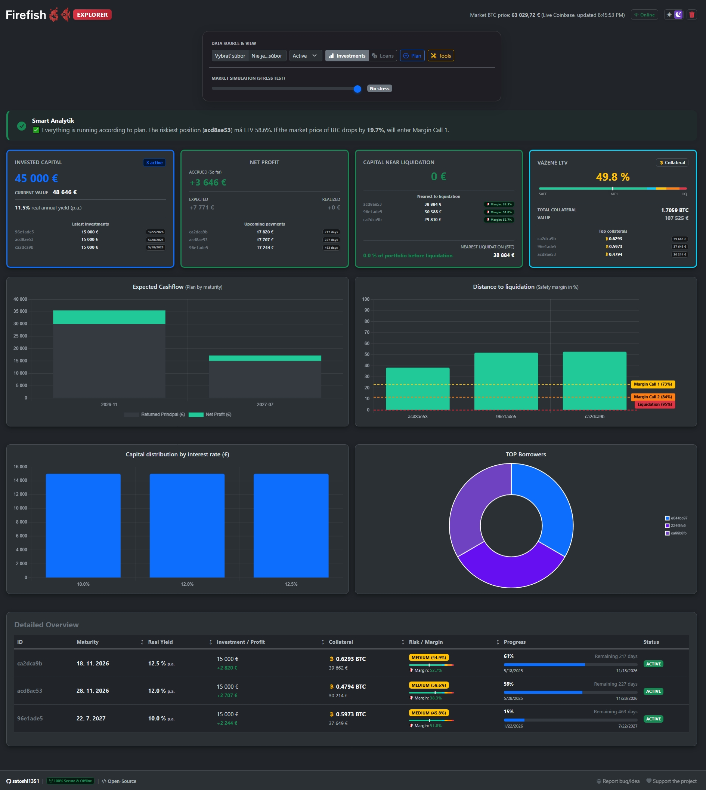

# Firefish EXPLORER

A powerful, privacy-first, client-side dashboard for analyzing your investments and loans on the [Firefish.io](https://firefish.io?ref=satoshi1351) platform. 

## Why Firefish Explorer?
The official Firefish platform is great, but as your portfolio grows, you need advanced analytics, risk management, and market simulations. Firefish Explorer takes your raw CSV data and turns it into a professional financial dashboard—**all without your data ever leaving your computer.**

## Key Features

- **100% Secure & Offline:** No backend, no databases, no tracking. The app runs entirely in your local browser. Your financial data is parsed and analyzed locally.
- **Dual-Mode (Lender & Borrower):** Automatically detects if you are lending money (Assets) or borrowing money (Liabilities) and toggles the entire UI, math, and terminology accordingly.
- **Market Simulation (Stress Test):** A real-time slider to simulate Bitcoin price drops (up to -70%). Instantly see which loans hit Margin Call 1 or liquidation limits.
- **Smart AI Analyst:** Contextual alerts that warn you about high concentration risks, upcoming liquidations, and required safety margins.
- **Advanced Visualizations:** Interactive charts for Cashflow, Liquidation Distances, Interest Rate distributions, and TOP Counterparties.
- **Built-in Simulator:** Plan new investments or loans and see how they impact your overall portfolio risk before executing them.
- **Firefish EXPLORER Tools** A dedicated module featuring a Market Compass, Opportunity Cost Calculator (HODL vs. Invest), and an A/B Investment Duel tool to make data-driven decisions.
- **Multi-language:** Auto-detects your browser language.
- **Dark/Light Mode:** Because staring at numbers should be easy on the eyes.

## Firefish EXPLORER Tools

The latest addition to Firefish Explorer is a dedicated analytics module designed to help you make forward-looking, strategic decisions using real-time market data and advanced math. **Plus, it features Smart Memory**—your calculator inputs are securely saved in your browser's local storage, so you never lose your setup if you refresh or return later.

- **Market Compass:** - *What it is:* A real-time sentiment gauge indicating who currently holds the statistical advantage in the market: the Borrower or the Lender.
  - *How it works:* It connects to a public API to fetch the live **Crypto Fear & Greed Index**. *Extreme Fear* (market panic) suggests a Borrower's advantage, as locking in collateral at the bottom historically carries a lower liquidation risk. *Extreme Greed* suggests a Lender's advantage, as lending fiat during a market peak increases the likelihood of a market correction and a profitable early loan liquidation.
  
- **HODL vs. Invest:** - *What it is:* An opportunity cost simulator that answers the ultimate crypto dilemma: "Should I lend my fiat on Firefish, or just buy and hold Bitcoin?"
  - *How it works:* You input your planned investment, the expected Firefish APY, and your predicted future BTC price. The tool mathematically calculates the exact **break-even price** (Current BTC Price + Loan APY %) and visually compares the expected profit of both strategies in real-time.
  
- **Investment Duel:**
  - *What it is:* An A/B testing tool to compare two different loan offers.
  - *How it works:* By entering the principal, APY, and duration of two separate offers, the tool calculates the **Total Expected Profit** and evaluates the overall investment efficiency. It acts as a smart judge, revealing which loan makes your money work faster and smarter (based on APY and time constraints), rather than just blindly looking at the highest absolute return.

## How to Use (Quick Start)

You don't need to install anything or set up a server. Choose the method that suits you best:

### Option 1: Use the Live Web App (Easiest)
1. Open the live application directly: **[Firefish EXPLORER](https://satoshi1351.github.io/firefish-explorer/)**
2. **Export your data:** Go to your Firefish account and export your loans/investments as a `.csv` file.
3. **Upload:** Drop the `.csv` file into the Explorer. 
4. *Enjoy your insights!*

### Option 2: Run Locally on Your Computer
1. **Download the project** (Clone the repo or download as ZIP).
2. **Open `index.html`** directly in your modern web browser (Chrome, Edge, Firefox, Safari).
3. **Export and Upload:** Follow steps 2 and 3 from Option 1 above.

## Tech Stack
- Vanilla JavaScript (ES6+)
- HTML5 & CSS3
- [Bootstrap 5.3](https://getbootstrap.com/) for responsive UI
- [Chart.js](https://www.chartjs.org/) for beautiful data visualization
- [PapaParse](https://www.papaparse.com/) for fast, local CSV parsing
- Coinbase Public API (only used to fetch the live BTC price)
- Alternative.me API (used for the Market Compass sentiment index)

*Created by [@satoshi1351](https://github.com/satoshi1351)*

---
**Disclaimer:** *This project is a community-built tool and is not officially affiliated with, maintained by, or endorsed by Firefish.io. Always verify your numbers. Use at your own risk.*